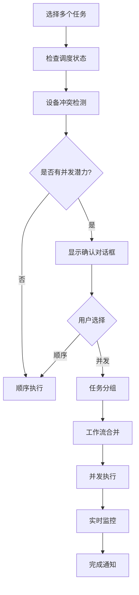

# 🚀 工作流并发执行功能指南

## 📋 功能概述

工作流并发执行是化学上位机软件平台的第三个重要优化功能，在已有的[网络异常处理和设备响应超时优化](./网络异常处理和设备超时优化指南.md)基础上，进一步提升系统执行效率。

### 核心特性

- **智能设备冲突检测**：自动分析多个任务间的设备使用冲突
- **任务并发分组**：使用贪心算法将无冲突任务分组并行执行
- **工作流命令合并**：将多个任务的7步工作流按步骤合并，减少通信开销
- **实时并发监控**：提供并发执行状态监控和进度跟踪
- **性能优化分析**：智能评估并发执行的效率提升潜力

## 🎯 技术原理

### 1. 设备冲突检测算法

```javascript
// 检测任务间设备使用冲突
detectDeviceConflicts(tasks) {
  const deviceUsage = new Map();     // 设备使用映射
  const conflictMatrix = new Map();  // 冲突矩阵
  
  // 1. 收集所有任务的设备使用情况
  tasks.forEach((task, taskIndex) => {
    // 从设备路径和参数配置中提取设备列表
    const taskDevices = extractDevicesFromTask(task);
    
    // 记录设备使用情况
    taskDevices.forEach(deviceId => {
      if (!deviceUsage.has(deviceId)) {
        deviceUsage.set(deviceId, []);
      }
      deviceUsage.get(deviceId).push({
        taskIndex, taskId: task.taskId, taskName: task.taskName
      });
    });
  });
  
  // 2. 构建任务间冲突矩阵
  return { deviceUsage, conflictMatrix, hasAnyConflict };
}
```

### 2. 并发分组算法

使用贪心算法将任务分组：

```javascript
// 贪心算法分组
groupTasksForConcurrentExecution(tasks) {
  const groups = [];
  const processed = new Set();
  
  tasks.forEach((task, taskIndex) => {
    if (processed.has(taskIndex)) return;
    
    // 创建新组
    const currentGroup = { tasks: [task], deviceList: [...task.deviceSet] };
    processed.add(taskIndex);
    
    // 尝试将其他无冲突任务加入组
    tasks.forEach((otherTask, otherIndex) => {
      if (processed.has(otherIndex)) return;
      
      // 检查设备冲突
      if (!hasConflictWithGroup(otherTask, currentGroup) && 
          currentGroup.tasks.length < maxConcurrentTasks) {
        currentGroup.tasks.push(otherTask);
        processed.add(otherIndex);
      }
    });
    
    groups.push(currentGroup);
  });
  
  return groups;
}
```

### 3. 工作流命令合并

将多个任务的7步工作流按步骤合并：

```javascript
// 合并工作流步骤
mergeWorkflowSteps(taskGroup) {
  const allWorkflows = taskGroup.tasks.map(task => generateTaskWorkflow(task));
  const mergedSteps = [];
  
  // 按步骤索引合并
  for (let stepIndex = 0; stepIndex < 7; stepIndex++) {
    const stepCommands = [];
    
    allWorkflows.forEach(workflow => {
      const step = workflow.steps[stepIndex];
      if (step && step.commands) {
        step.commands.forEach(command => {
          stepCommands.push({
            ...command,
            sourceTask: task.taskId,
            sourceTaskName: task.taskName
          });
        });
      }
    });
    
    mergedSteps.push({
      name: `步骤 ${stepIndex + 1}`,
      type: 'concurrent',
      commands: stepCommands,
      parallelExecution: true
    });
  }
  
  return { steps: mergedSteps, mergeStrategy: 'parallel' };
}
```

## 🎮 使用方法

### 1. 界面操作

#### 启用并发执行
1. 在任务列表中选择多个已调度的任务
2. 确保界面右下角的"并发/顺序"开关处于"并发"状态
3. 点击"Run selected tasks workflow"按钮

#### 并发分析
1. 选择多个任务后，点击工具栏中的"并发分析"标签
2. 查看详细的并发执行分析报告
3. 了解设备使用情况和预期效率提升

### 2. 系统响应

#### 自动检测
```javascript
// 系统自动检测并发执行可能性
if (concurrentExecution.enabled && executionPlan.length > 1) {
  const concurrentGroups = groupTasksForConcurrentExecution(executionPlan);
  const canBenefit = concurrentGroups.length < executionPlan.length;
  
  if (canBenefit) {
    // 显示并发执行确认对话框
    const efficiency = Math.round((1 - concurrentGroups.length / executionPlan.length) * 100);
    showConcurrentConfirmDialog(efficiency);
  }
}
```

#### 用户确认对话框
```
检测到可以并发执行任务：
• 总任务数: 6
• 并发组数: 2
• 预计提升效率: 67%

是否启用并发执行模式？
[启用并发执行] [顺序执行]
```

### 3. 执行流程



## 📊 监控和状态

### 1. 实时状态显示

系统提供多层级的状态监控：

```javascript
// 并发执行状态结构
concurrentExecution: {
  enabled: true,                    // 是否启用
  maxConcurrentTasks: 5,           // 最大并发任务数
  currentGroups: [],               // 当前并发组
  groupStatus: new Map(),          // 组执行状态
  deviceUsageMap: new Map(),       // 设备使用映射
}
```

### 2. 执行进度跟踪

```javascript
// 组状态监控
groupStatus: {
  'group_0': {
    status: 'running',              // pending/running/completed/failed
    startTime: Date,                // 开始时间
    endTime: null,                  // 结束时间
    currentStepIndex: 2,            // 当前步骤索引
    completedSteps: 1,              // 已完成步骤数
    errors: []                      // 错误列表
  }
}
```

### 3. WebSocket消息类型

#### 并发工作流消息
- `concurrentWorkflowStarted`: 并发工作流开始
- `concurrentGroupStarted`: 并发组开始执行
- `concurrentGroupCompleted`: 并发组执行完成
- `concurrentWorkflowCompleted`: 并发工作流完成
- `concurrentWorkflowError`: 并发工作流错误

## 🔧 配置选项

### 1. 并发执行配置

```javascript
// 可配置参数
concurrentExecution: {
  enabled: true,                    // 启用/禁用并发执行
  maxConcurrentTasks: 5,           // 单个并发组最大任务数
  conflictDetectionMode: 'strict', // 冲突检测模式: strict/loose
  mergeStrategy: 'parallel',       // 合并策略: parallel/sequential
  timeoutSettings: {
    groupTimeout: 300000,          // 组执行超时 (5分钟)
    commandTimeout: 30000          // 命令执行超时 (30秒)
  }
}
```

### 2. 设备冲突检测配置

```javascript
// 冲突检测设置
conflictDetection: {
  devicePathWeight: 1.0,          // 设备路径权重
  parametersWeight: 0.8,          // 参数配置权重
  excludeDeviceTypes: [],         // 排除的设备类型
  allowSharedDevices: []          // 允许共享的设备列表
}
```

## 📈 性能指标

### 1. 效率提升计算

```javascript
// 效率提升算法
function calculateEfficiencyGain(originalTasks, concurrentGroups) {
  const sequentialTime = originalTasks.reduce((sum, task) => sum + task.duration, 0);
  const concurrentTime = Math.max(...concurrentGroups.map(group => 
    group.tasks.reduce((sum, task) => sum + task.duration, 0)
  ));
  
  const speedup = sequentialTime / concurrentTime;
  const efficiency = (speedup / originalTasks.length) * 100;
  
  return { speedup, efficiency, timeSaved: sequentialTime - concurrentTime };
}
```

### 2. 性能监控指标

- **并发效率**: `(加速比 / 任务数) × 100%`
- **设备利用率**: `活跃设备数 / 总设备数`
- **命令合并率**: `合并后命令数 / 原始命令数`
- **执行时间节省**: `顺序执行时间 - 并发执行时间`

## 🛠️ 故障排除

### 1. 常见问题

#### 问题1: 检测不到并发潜力
**症状**: 多个任务总是被判定为有冲突
**原因**: 任务使用了相同的设备或参数配置
**解决方案**:
1. 检查任务的设备路径是否有重叠
2. 调整冲突检测模式为`loose`
3. 手动配置允许共享的设备类型

#### 问题2: 并发执行失败
**症状**: 并发组执行中途失败
**原因**: 设备响应超时或命令冲突
**解决方案**:
1. 检查设备连接状态
2. 增加命令超时时间设置
3. 查看设备响应日志

#### 问题3: 性能提升不明显
**症状**: 并发执行时间与顺序执行相近
**原因**: 任务间依赖性强或设备瓶颈
**解决方案**:
1. 分析任务的设备使用模式
2. 调整任务分组策略
3. 优化工作流步骤设计

### 2. 调试工具

#### 启用详细日志
```javascript
// 在浏览器控制台中启用调试
localStorage.setItem('concurrent_debug', 'true');
// 刷新页面后查看详细的并发执行日志
```

#### 冲突矩阵分析
```javascript
// 在控制台查看设备冲突矩阵
console.table(this.concurrentExecution.conflictMatrix);
```

#### 性能分析报告
```javascript
// 获取并发执行性能报告
this.analyzeConcurrentPotential();
```

## 🧪 测试验证

### 1. 功能测试

使用提供的测试脚本验证功能：

```bash
cd pure-admin-backend
node test-concurrent-workflow.js
```

### 2. 测试场景

- **无冲突任务并发**: 验证完全无设备冲突的任务能否正确并发执行
- **冲突解决**: 验证有设备冲突的任务能否正确分组执行
- **性能对比**: 对比并发执行与顺序执行的性能差异
- **错误恢复**: 验证并发执行过程中的错误处理和恢复机制

### 3. 期望结果

- ✅ 并发执行成功率 > 95%
- ✅ 性能提升 > 30%（对于无冲突任务）
- ✅ 错误恢复时间 < 10秒
- ✅ 设备利用率 > 80%

## 📚 API参考

### 1. 前端API

#### 并发执行方法
```javascript
// 启动并发工作流执行
await this.startConcurrentWorkflowExecution(executionPlan);

// 分析并发潜力
await this.analyzeConcurrentPotential();

// 检测设备冲突
const conflicts = this.detectDeviceConflicts(tasks);

// 任务分组
const groups = this.groupTasksForConcurrentExecution(tasks);
```

#### 配置管理
```javascript
// 启用/禁用并发执行
this.concurrentExecution.enabled = true;

// 设置最大并发任务数
this.concurrentExecution.maxConcurrentTasks = 5;
```

### 2. 后端API

#### WebSocket消息类型
```javascript
// 发送并发工作流
{
  type: 'executeConcurrentWorkflow',
  workflowId: 'workflow_id',
  groups: [/* 并发组数据 */],
  totalGroups: 2
}

// 接收并发状态更新
{
  type: 'concurrentGroupStarted',
  data: {
    workflowId: 'workflow_id',
    groupId: 'group_0',
    groupName: '并发组 1',
    taskCount: 3
  }
}
```

## 🔗 相关文档

- [网络异常处理和设备超时优化指南](./网络异常处理和设备超时优化指南.md)
- [系统架构文档](./系统架构文档.md)
- [API文档](./API文档.md)
- [故障排除指南](./故障排除指南.md)

## 💡 最佳实践

### 1. 任务设计原则

- **设备独立性**: 设计任务时尽量减少设备共享
- **步骤标准化**: 保持工作流步骤的一致性
- **参数优化**: 合理配置设备参数以减少冲突

### 2. 系统配置建议

- **硬件资源**: 确保足够的CPU和内存支持并发执行
- **网络稳定**: 保持稳定的网络连接以支持并发通信
- **设备容量**: 验证下位机设备能够处理并发命令

### 3. 监控和维护

- **定期性能评估**: 定期分析并发执行的效率提升
- **设备状态监控**: 密切关注设备在并发模式下的运行状态
- **日志管理**: 保留详细的并发执行日志用于故障分析

---

🎉 通过工作流并发执行功能，化学上位机软件平台在保证安全性的前提下，大幅提升了任务执行效率，为用户提供了更优秀的使用体验！ 